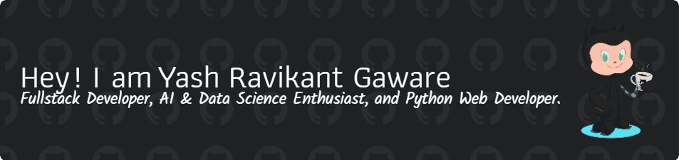

<h1 align="center">Hi 👋, I'm Yash Ravikant Gaware</h1>
<h3 align="center">A passionate Computer Engineering student from Pune,India</h3>
<h3 align="center">WELCOME TO MY GITHUB PROFILE </h3> 

  

- 👨‍💻 All of my projects are available at <a href="https://linktr.ee/_yash5223" ><ul>Link</ul></a>
- ⚡ Fun fact **I sometimes fix bugs just by staring at the screen! 😆**
<h3 align="left">Connect with me:</h3>

 
<h3 align="left">Languages and Tools:</h3>

 

  
  
  
  
  
  
  
  
  
  
  
  
  
  
  
  
  
  
  
  
  
  
  
  
  
  
  
  
  
  
  
  
  </a> 
   
<h2 align="left">About me</h2>

✨ Creating bugs since I wrote my first line of code 📚 I'm currently learning advanced algorithms and software development 🎯 Goals: To become a skilled software developer and win hackathons 🎲 Fun fact: I sometimes fix a bug just by staring at the screen! 😆
  

&nbsp;

